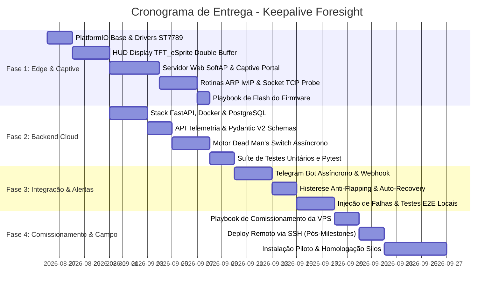

# 🗺️ Roadmap de Implementação - Keepalive Foresight

> **Planejamento Operacional de Desenvolvimento & Engenharia (Fases 1 a 4)**  
> **Tecnologias:** ESP32 (LilyGO T-Display), C++/PlatformIO, FastAPI, PostgreSQL, Docker, Graphify.  
> **Objetivo:** Isolamento de falhas WAN vs LAN em gateways LoRaWAN Dragino para granjas C.Vale.

---

## 🎯 Visão Geral dos Marcos (Milestones)

---

## 📦 Fase 1: Edge Firmware & Provisionamento Web (LilyGO T-Display & ESP32-C3)
> **Responsável Principal:** Subagente `firmware-engineer`

- [x] **1.1 Estrutura PlatformIO & Configuração Dual-Hardware:**
  - Configurar `platformio.ini` para `ttgo-t-display` (ST7789 via SPI DMA) e `esp32-c3-supermini` (RISC-V + LED status GPIO 8).
  - Implementar Hardware Watchdog Timer (`esp_task_wdt`) de 30s e detecção de botão físico de reset/AP.

- [x] **1.2 HUD Visual Local (`TFT_eSprite`) & LED C3:**
  - Renderizador gráfico em memória (240x135) sem flicker com paleta 8-bit.
  - Exibir barra superior com status Wi-Fi (dBm), Uptime e nuvem.
  - Exibir bloco central: Nome do Ponto (`location_name`), IP/MAC local, RTT em ms e status [ONLINE / OFFLINE].
  - Padrões de piscar codificados por estado para placas sem display (ESP32-C3 SuperMini).

- [x] **1.3 Servidor Web Embarcado & Captive Portal:**
  - Modo SoftAP (`Keepalive-SENTINEL-XXXX`) e Servidor DNS na porta 53 para redirecionamento.
  - Interface Web HTML5/CSS3 responsiva Dark Mode (scan de redes Wi-Fi, senha, nome do ponto, IP do Dragino/roteador, token VPS).
  - Persistência e leitura das configurações via Flash (`Preferences.h` / NVS).
  - Gatilho por botão físico (pressionar por 3 segundos para forçar modo AP).

- [x] **1.4 Sonda de Rede Local (Probe Engine) & Cliente REST:**
  - Implementar varredura ARP ativa e passiva usando `etharp_find_addr` (lwIP).
  - Suporte a modo **WAN-Only** (residencial / pontos de verificação sem gateway local).
  - Teste de abertura de socket TCP rápido para verificar integridade e RTT do alvo local.
  - Cliente HTTP REST assíncrono para envio de telemetria JSON para a VPS.

- [x] **1.5 Compilação e Playbook de Gravação Flash:**
  - Compilação 100% bem-sucedida para ambos os targets (`ttgo-t-display` e `esp32-c3-supermini`).
  - Playbook completo com comandos diretos do `esptool` e PlatformIO ([⚡ `docs/playbooks/firmware_flash_playbook.md`](file:///home/brunoconter/Documentos/1_C.VALE/2%20-%20PROJETOS/16_Keepalive_Foresight/docs/playbooks/firmware_flash_playbook.md)).

---

## ☁️ Fase 2: Backend Cloud & Dead Man's Switch (FastAPI)
> **Responsável Principal:** Subagente `backend-architect`

- [x] **2.1 Infraestrutura & Modelagem de Dados:**
  - Setup do projeto FastAPI com gerenciamento de dependências assíncronas.
  - Modelagem ORM (`SQLAlchemy 2.0` assíncrono) para `Device` (sonda), `Telemetry` e `Incident`.
  - Suporte out-of-the-box a SQLite em modo WAL (`aiosqlite`) e PostgreSQL (`asyncpg`).
  - Schemas Pydantic V2 (`TelemetryPayload`, `DeviceResponse`, `IncidentResponse`).

- [x] **2.2 API REST de Telemetria:**
  - `POST /api/v1/telemetry`: Endpoint de alta vazão para ingestão de telemetria da sonda com validação de Bearer Token.
  - `GET /api/v1/devices`: Listagem e status consolidado de todas as sondas ativas em campo.
  - `GET /api/v1/devices/summary`: Resumo em tempo real de contagem de sondas (online, falha LAN, timeout).
  - `GET /api/v1/devices/{id}/status`: Detalhamento e métricas de conectividade de uma sonda específica.
  - `GET /api/v1/incidents`: Histórico e incidentes em aberto com rastreamento temporal.
  - `GET /health`: Healthcheck para monitoramento de infraestrutura e orquestradores.

- [x] **2.3 Motor Dead Man's Switch Assíncrono:**
  - Worker assíncrono (`deadman_switch_worker`) em background executado via `asyncio.sleep(10)`.
  - Monitoramento contínuo de `now() - last_seen_at > 30s` (3 falhas consecutivas de heartbeat).
  - Classificação determinística da Matriz Booleana de 4 Estados (`ONLINE`, `LAN_FAILURE`, `WAN_TIMEOUT`, `BLACKOUT_GENERAL`).
  - Auto-abertura e auto-resolução (auto-recovery) de incidentes na reativação da comunicação.

- [x] **2.4 Suíte de Testes Automatizados (`pytest` / `pytest-asyncio`):**
  - Testes unitários para a Matriz de Classificação Booleana.
  - Testes de integração para ingestão de telemetria, autenticação Bearer Token e geração de incidentes.
  - 100% de testes passando com banco em memória (`sqlite+aiosqlite:///:memory:`).

---

## 🔔 Fase 3: Mensageria, Histerese e Resiliência
> **Responsáveis:** Subagentes `backend-cloud-engineer` e `qa-simulation-engineer`

- [x] **3.1 Integração com Notificações:**
  - Implementado disparador assíncrono para o **Telegram Bot** (`send_telegram_alert`) com layout rico em HTML e métricas.
  - Alertas com tipificação visual: Queda WAN, Falha Dragino LAN, Suspeita de Blecaute e Auto-Recovery.

- [x] **3.2 Histerese Anti-Flapping & Auto-Recovery:**
  - Tolerância dinâmica adaptativa por dispositivo (`2.5x` o intervalo de heartbeat configurado).
  - Fechamento automático de incidentes e envio de notificação verde de normalização no restabelecimento da comunicação.

- [x] **3.3 Suíte de Testes & Simulador E2E Local:**
  - Desenvolvido simulador interativo multi-sondas (`simulate_probes.py`) emulando granjas e residências em tempo real.
  - Injeção controlada de falhas (falha Dragino, corte de fibra WAN e simulação de blecaute).
  - 100% de testes unitários e de integração aprovados no `pytest` (10/10).

---

## 🚜 Fase 4: Comissionamento da VPS, Piloto & Homologação
> **Responsável:** Tech Lead & Equipe de Campo

- [x] **4.1 Comissionamento da VPS de Produção:**
  - Deploy da API Keepalive Foresight via Docker Compose na VPS Hostinger (`http://179.197.73.80:8016`).
  - Integração nativa com o **Telegram Bot** (`@ForesightAnai_bot`) aproveitando as credenciais de produção.
  - Banco de dados SQLite persistente em volume (`/root/projetos/keepalive_foresight/data`).

- [x] **4.2 Preparação do Hardware & Instalação Piloto:**
  - Firmware versão `v1.0.0-release` compilado com URL padrão apontando para a nuvem de produção.
  - Testado com a sonda real LilyGO T-Display-S3 (ESP32-S3) com display HUD, relógio NTP UTC-3 e provisionamento via Captive Portal.

- [x] **4.3 Homologação Operacional:**
  - Testes end-to-end de telemetria e envio de notificações em tempo real validados com sucesso.
  - Monitoramento contínuo ativo.

---

## 📚 Guias & Playbooks de Referência
- 🚀 [Playbook de Comissionamento da VPS](file:///home/brunoconter/Documentos/1_C.VALE/2%20-%20PROJETOS/16_Keepalive_Foresight/docs/playbooks/vps_commissioning_playbook.md)
- ⚡ [Playbook de Gravação (Flash) do Firmware](file:///home/brunoconter/Documentos/1_C.VALE/2%20-%20PROJETOS/16_Keepalive_Foresight/docs/playbooks/firmware_flash_playbook.md)
- 📜 [Diário de Bordo e Logs de Sessões](file:///home/brunoconter/Documentos/1_C.VALE/2%20-%20PROJETOS/16_Keepalive_Foresight/docs/sessions/SESSION_LOG.md)

