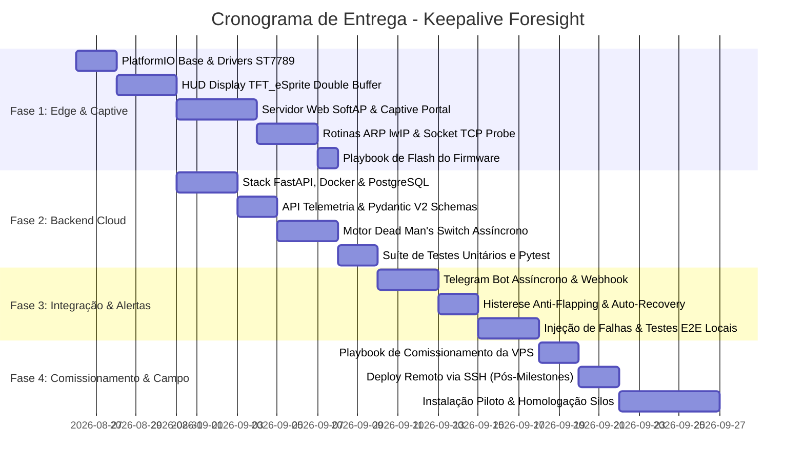

# 🗺️ Roadmap de Implementação - Keepalive Foresight

> **Planejamento Operacional de Desenvolvimento & Engenharia (Fases 1 a 4)**  
> **Tecnologias:** ESP32 (LilyGO T-Display), C++/PlatformIO, FastAPI, PostgreSQL, Docker, Graphify.  
> **Objetivo:** Isolamento de falhas WAN vs LAN em gateways LoRaWAN Dragino para granjas C.Vale.

---

## 🎯 Visão Geral dos Marcos (Milestones)

---

## 📦 Fase 1: Edge Firmware & Provisionamento Web (ESP32 / LilyGO)
> **Responsável Principal:** Subagente `firmware-engineer`

- [ ] **1.1 Estrutura PlatformIO & Configuração de Hardware:**
  - Configurar `platformio.ini` com build flags para ST7789 via SPI DMA.
  - Mapear pinout (`TFT_MOSI:19`, `TFT_SCLK:18`, `TFT_CS:5`, `TFT_DC:16`, `TFT_RST:23`, `TFT_BL:4`).
  - Implementar Hardware Watchdog Timer (`esp_task_wdt`) de 30s.

- [ ] **1.2 HUD Visual Local (`TFT_eSprite`):**
  - Desenvolver renderizador gráfico em memória (240x135) sem flicker.
  - Exibir barra superior com status Wi-Fi (dBm), Uptime e nuvem.
  - Exibir bloco central: IP/MAC do Dragino, RTT local em ms e status [ONLINE / OFFLINE].

- [ ] **1.3 Servidor Web Embarcado & Captive Portal:**
  - Criar modo SoftAP (`Keepalive-Probe-XXXX`) e Servidor DNS na porta 53 para redirecionamento.
  - Interface Web HTML5/CSS3 responsiva (scan de redes Wi-Fi, senha, IP do Dragino, token VPS).
  - Persistência e leitura das configurações via Flash (`Preferences.h` / NVS).
  - Gatilho por botão físico (pressionar IO35 por 5 segundos para forçar modo AP).

- [ ] **1.4 Sonda de Rede Local (Probe Engine):**
  - Implementar varredura ARP ativa e passiva usando `etharp_find_addr` (lwIP).
  - Implementar teste de abertura de socket TCP rápido (porta 80/22) para verificar integridade do Dragino.
  - Medição do RTT local em milissegundos.

- [ ] **1.5 Validação de Gravação Flash:**
  - Seguir o [⚡ Playbook de Gravação do Firmware](file:///home/brunoconter/Documentos/1_C.VALE/2%20-%20PROJETOS/16_Keepalive_Foresight/docs/playbooks/firmware_flash_playbook.md).
  - Validar sequência de boot no monitor serial (115200 baud) e acendimento do ST7789.

---

## ☁️ Fase 2: Backend Cloud & Dead Man's Switch (FastAPI)
> **Responsável Principal:** Subagente `backend-cloud-engineer`

- [ ] **2.1 Infraestrutura & Modelagem de Dados:**
  - Configurar `Dockerfile.backend` e `docker-compose.yml` (FastAPI + PostgreSQL 16 + Nginx).
  - Criar migrações Alembic e modelos ORM (`Farm`, `Device`, `Telemetry`, `Incident`).

- [ ] **2.2 API REST de Telemetria:**
  - Criar rota `POST /api/v1/telemetry` com validação Pydantic V2 e autenticação por Bearer Token.
  - Criar rotas de consulta: `GET /api/v1/devices/{id}/status` e `GET /api/v1/incidents`.
  - Healthcheck da aplicação (`GET /health`).

- [ ] **2.3 Motor Dead Man's Switch:**
  - Implementar worker assíncrono rodando a cada 10 segundos para verificar `now() - last_seen_at`.
  - Classificação lógica booleana dos 4 estados operacionais:
    1. *Tudo Operacional*
    2. *Falha Local do Gateway Dragino (WAN OK)*
    3. *Queda de Link WAN (Timeout na VPS)*
    4. *Queda Geral / Blecaute*

- [ ] **2.4 Suíte de Testes Automatizados (pytest):**
  - Implementar testes unitários para schemas Pydantic e regras de classificação.
  - Validar timeouts do Dead Man's Switch em memória com `pytest-asyncio`.

---

## 🔔 Fase 3: Mensageria, Histerese e Resiliência
> **Responsáveis:** Subagentes `backend-cloud-engineer` e `qa-simulation-engineer`

- [ ] **3.1 Integração com Notificações:**
  - Implementar disparador assíncrono para o **Telegram Bot** com layout rico em HTML e métricas.
  - Webhooks genéricos para integração com sistemas de chamados ou TMS.

- [ ] **3.2 Histerese Anti-Flapping & Auto-Recovery:**
  - Implementar contadores de falhas consecutivas (3 falhas para abertura de incidente).
  - Implementar fechamento automático de incidente após 2 heartbeats saudáveis consecutivos.

- [ ] **3.3 Suíte de Testes & Simulador E2E Local:**
  - Desenvolver script de teste emulando sondas ESP32 enviando telemetria em tempo real.
  - Simular cenários de injeção de falhas (corte abrupto de sinal, queda de gateway, reconexão).
  - Execução 100% aprovada no `pytest`.

---

## 🚜 Fase 4: Comissionamento da VPS, Piloto & Homologação
> **Responsável:** Tech Lead & Equipe de Campo

- [ ] **4.1 Comissionamento da VPS de Produção:**
  - Receber endereço IP/domínio e credenciais SSH do usuário após aprovação das Fases 1 a 3.
  - Executar o [🚀 Playbook de Comissionamento da VPS](file:///home/brunoconter/Documentos/1_C.VALE/2%20-%20PROJETOS/16_Keepalive_Foresight/docs/playbooks/vps_commissioning_playbook.md) (Hardening UFW, Docker, SSL Certbot, Deploy Compose).

- [ ] **4.2 Preparação do Hardware & Instalação Piloto:**
  - Impressão 3D de case protetor para LilyGO T-Display com suporte para trilho DIN e conectores de alimentação.
  - Gravação do firmware versão `v1.0.0-release` nos dispositivos de teste.
  - Instalação no aviário da granja piloto junto ao Gateway Dragino com provisionamento via smartphone.

- [ ] **4.3 Homologação Operacional:**
  - Monitoramento contínuo comparado com o fluxo de dados dos sensores de silos de ração.
  - Validação da precisão de alertas em incidentes reais de provedor rural.

---

## 📚 Guias & Playbooks de Referência
- 🚀 [Playbook de Comissionamento da VPS](file:///home/brunoconter/Documentos/1_C.VALE/2%20-%20PROJETOS/16_Keepalive_Foresight/docs/playbooks/vps_commissioning_playbook.md)
- ⚡ [Playbook de Gravação (Flash) do Firmware](file:///home/brunoconter/Documentos/1_C.VALE/2%20-%20PROJETOS/16_Keepalive_Foresight/docs/playbooks/firmware_flash_playbook.md)
- 📜 [Diário de Bordo e Logs de Sessões](file:///home/brunoconter/Documentos/1_C.VALE/2%20-%20PROJETOS/16_Keepalive_Foresight/docs/sessions/SESSION_LOG.md)

