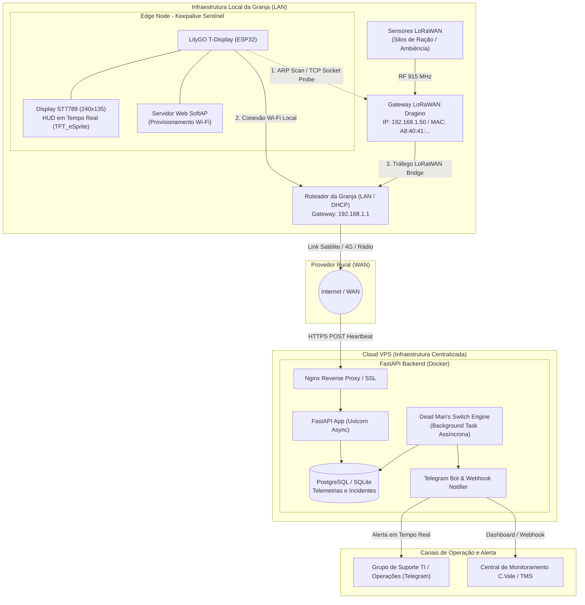
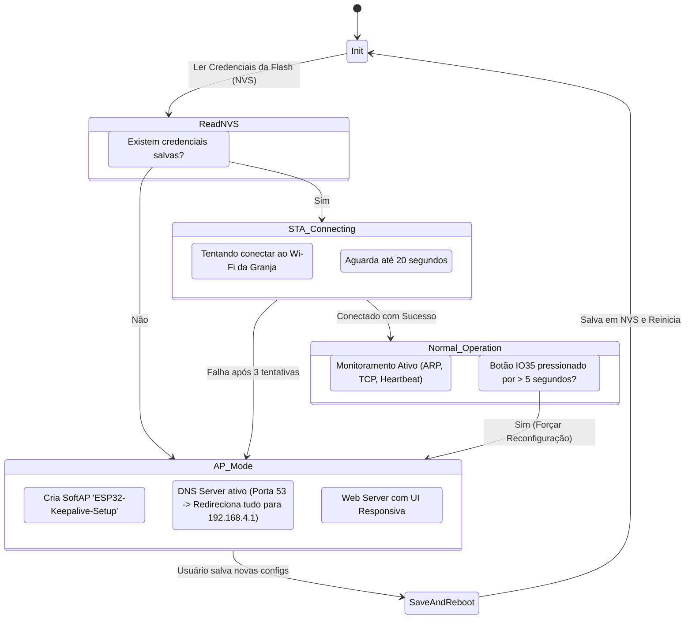
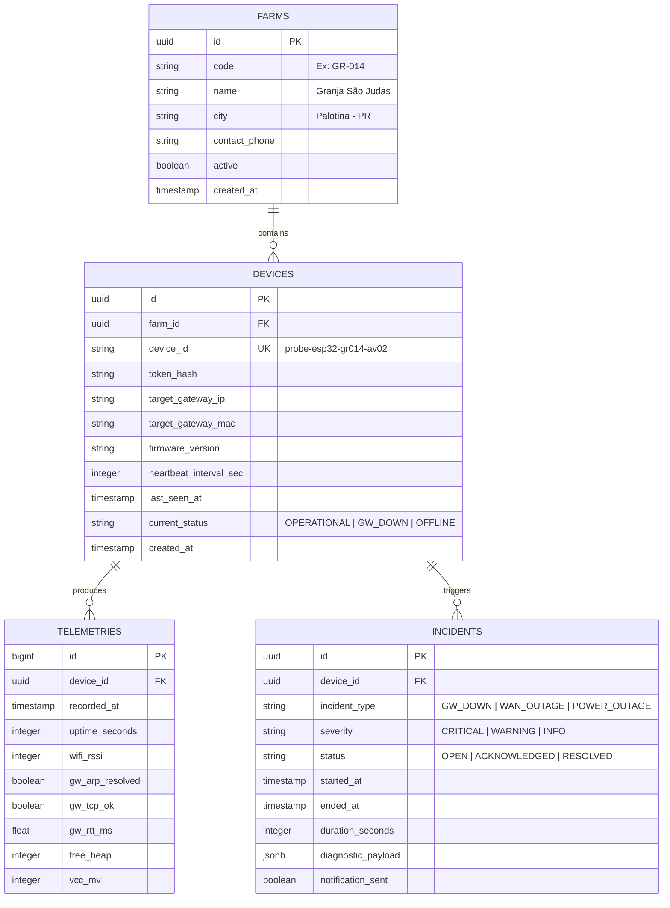
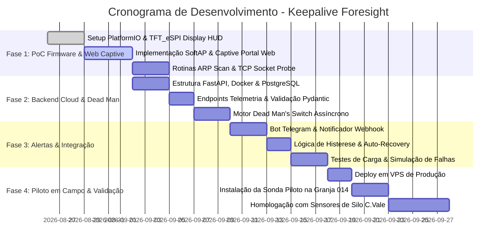
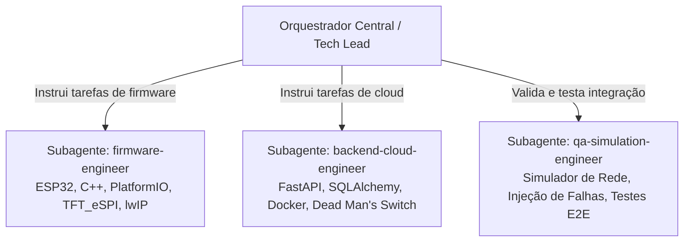

# Keepalive Foresight: Sistema de Diagnóstico e Monitoramento de Conectividade Rural (WAN vs LAN)

> **Documento de Arquitetura, Especificação Técnica e Inicialização de Projeto (`idea.md`)**  
> **Autor:** Engenharia de Sistemas Embarcados & IoT  
> **Status:** Aprovado para Desenvolvimento  
> **Versão:** 1.0.0  

---

## 1. Visão Geral e Declaração do Problema

### 1.1 Contexto Operacional
Em ambientes agroindustriais e granjas integradas, a telemetria contínua proveniente de sensores IoT (como sensores ultrassônicos/radar de nível em silos de ração, sensores de ambiência, temperatura, umidade e consumo de água) é crítica para a tomada de decisão logística e zootécnica. A solução proposta para mitigar rupturas e falhas baseia-se em três pilares fundamentais:
1. **Comunicação Eficiente:** Plataforma centralizada com visibilidade em tempo real.
2. **Processos Otimizados:** Redesenho de fluxo operacional e confirmação ágil de eventos.
3. **Tecnologia Habilitadora:** TMS, telemetria em silos e telemetria de conectividade resiliente.

Na ponta (Edge), os sensores transmitem via protocolo **LoRaWAN** para um **Gateway Dragino** instalado na infraestrutura da granja. Este gateway repassa os pacotes via rede local (Ethernet/Wi-Fi) para o roteador da granja, que por sua vez escoa os dados via WAN (provedor de internet rural via rádio, satélite/Starlink ou 4G) até a nuvem.

```
[Sensores Silos/Ambiência LoRaWAN] 
       │ (RF 915 MHz)
       ▼
[Gateway Dragino LoRaWAN] 
       │ (LAN Wi-Fi/Ethernet)
       ▼
[Roteador Rural / WAN] ──(Internet)──► [Cloud / TMS / Ingestão]
```

### 1.2 O Problema: O Gap de Diagnóstico (WAN vs LAN)
Quando os dados dos sensores deixam de chegar à nuvem, a equipe de TI/Suporte enfrenta uma ambiguidade crítica de diagnóstico:
- **Cenário A (Queda de Link WAN):** O provedor rural de internet oscilou ou caiu, mas o Gateway Dragino está ligado, saudável e processando pacotes LoRaWAN na rede local.
- **Cenário B (Falha Local do Gateway Dragino):** O link de internet da granja está 100% funcional, porém o Gateway Dragino travou (kernel panic/congelamento de socket), sofreu desconexão de LAN ou sofreu desligamento isolado da sua fonte AC/DC.
- **Cenário C (Queda Geral de Energia / Blecaute Rural):** A granja inteira ficou sem energia elétrica (ou disjuntor geral caiu), derrubando simultaneamente roteador, gateway e sondas sem nobreak.

Sem uma **Sonda de Monitoramento Independente (Edge Probe)** no local, a equipe de suporte perde horas tentando contato telefônico com o produtor rural ou acionando técnicos de campo para trocar cabos/gateways quando a falha era apenas de sinal do provedor de internet (e vice-versa).

### 1.3 Proposta de Valor do Keepalive Foresight
O projeto **Keepalive Foresight** implementa uma sonda sentinela de baixo custo baseada no microcontrolador **LilyGO T-Display (ESP32 com display TFT ST7789)**, operando em conjunto com um **Backend Cloud em FastAPI** com arquitetura de **Dead Man's Switch**.

A sonda atua como observador independente dentro da mesma LAN da granja:
1. Testa localmente a presença e a responsividade do Gateway Dragino (via ARP Table scan, TCP Ping nas portas de serviço e ICMP).
2. Transmite periodicamente um **Heartbeat enriquecido via HTTP POST** para a VPS Cloud.
3. Exibe em display colorido local o diagnóstico imediato para o produtor/técnico que estiver fisicamente no aviário.
4. Disponibiliza um **Servidor Web Embarcado (Captive Portal)** para configuração simples de Wi-Fi sem necessidade de reprogramar o firmware.
5. Permite ao Backend Cloud classificar com precisão temporal de segundos a causa raiz de qualquer interrupção, disparando alertas imediatos via Telegram Bot e Webhook.

---

## 2. Arquitetura da Solução

### 2.1 Diagrama de Arquitetura de Ponta a Ponta (Mermaid)



---

## 3. Especificação de Componentes

### 3.1 Módulo Edge (Firmware ESP32 / LilyGO T-Display)

#### 3.1.1 Hardware e Pinout
- **MCU:** ESP32-D0WDQ6 Dual Core 240MHz, 520KB SRAM, 4MB Flash, Wi-Fi 802.11 b/g/n + BLE.
- **Display Integrado:** ST7789V IPS 1.14 polegadas (Resolução 240x135 pixels, interface SPI de 4 fios).
- **Pinout LilyGO T-Display:**
  - `TFT_MOSI`: GPIO 19
  - `TFT_SCLK`: GPIO 18
  - `TFT_CS`: GPIO 5
  - `TFT_DC`: GPIO 16
  - `TFT_RST`: GPIO 23
  - `TFT_BL` (Backlight): GPIO 4 (PWM com controle de brilho)
  - `BUTTON_1` (IO35): Entrada de botão superior (utilizado para alternar telas ou acionar modo AP).
  - `BUTTON_2` (IO00): Entrada de botão inferior / Boot.
  - `ADC_BATTERY` (IO34): Leitura de tensão de bateria/alimentação via divisor resistivo.

#### 3.1.2 Stack de Firmware e Bibliotecas
- **Framework:** C++ sobre PlatformIO com framework Arduino/ESP-IDF.
- **Bibliotecas Principais:**
  - `TFT_eSPI` (Renderização ultra-rápida via SPI DMA).
  - `TFT_eSprite` (Frame buffer em memória para eliminar flicker no display).
  - `ArduinoJson` (v7.x - Serialização eficiente de JSON para o payload de telemetria).
  - `AsyncTCP` & `ESPAsyncWebServer` (ou WebServer nativo assíncrono para captive portal).
  - `Preferences.h` / `nvs_flash` (Persistência segura em memória Flash de credenciais Wi-Fi e configs).
  - `esp_task_wdt.h` (Hardware Watchdog Timer de 30 segundos).
  - `lwip/etharp.h` & `lwip/sockets.h` (Inspeção de tabela ARP e sockets TCP de baixa latência).

#### 3.1.3 Rotinas de Rede e Diagnóstico Local
1. **Varredura e Inspeção de MAC/ARP:**
   - Consulta a tabela ARP interna do lwIP (`etharp_find_addr`) após enviar pacotes UDP broadcast ou TCP SYN para o IP do Dragino.
   - Validação se o endereço MAC associado ao IP do Dragino confere com o OUI Dragino (ex: `A8:40:41:...` ou `EC:1B:BD:...`).
2. **Socket TCP Probe:**
   - Tentativa de abertura de socket TCP não-bloqueante na porta de gerenciamento do Dragino (Porta 80 HTTP, Porta 22 SSH ou Porta 1700 Semtech Packet Forwarder).
   - Medição do tempo de resposta local (RTT em milissegundos).
3. **Heartbeat HTTP POST:**
   - Disparo a cada intervalo configurável (padrão: 30 segundos) de um payload JSON para o endpoint `/api/v1/telemetry` da VPS.
   - Suporte a retries com backoff exponencial se a conexão falhar.
4. **Hardware Watchdog (WDT):**
   - Configurado para timeout de 30 segundos. Alimentado a cada iteração do loop principal após as checagens críticas.
   - Protege contra bloqueios de stack de rede ou loops infinitos de Wi-Fi.

#### 3.1.4 HUD Visual Local (TFT_eSprite)
O display de 240x135 pixels exibe um painel de alta densidade sem flicker usando double buffering com `TFT_eSprite`:
- **Barra Superior:** Status Wi-Fi (Ícone + RSSI em dBm), Status WAN (Ícone Nuvem OK/FAIL), Uptime.
- **Corpo Central:**
  - `GW DRAGINO`: [ ONLINE (12ms) | UNREACHABLE | IP CHANGE ]
  - `GW IP`: `192.168.1.50` | `MAC`: `A8:40:41:XX:YY:ZZ`
  - `WAN RTT`: `48ms` | `FAILS`: `0`
- **Barra Inferior:** IP local atribuído à sonda (`192.168.1.105`) e última sincronização com a nuvem.

---

## 4. Servidor Web Embarcado (Captive Portal / WiFi Provisioning)

Para permitir que o técnico de campo instale e configure o dispositivo sem precisar de um computador ou compilar código, o firmware possui um **Servidor Web de Provisionamento com Captive Portal**.

### 4.1 Modos de Operação do Wi-Fi


### 4.2 Especificações do Servidor Web no Embarcado
- **SSID do SoftAP:** `Keepalive-Probe-[MAC_SUFFIX]` (Aberto ou com senha padrão `cvale12345`).
- **IP do SoftAP:** `192.168.4.1` (Gateway e DNS Server).
- **DNS Server Embutido:** Captura qualquer requisição DNS (como `connectivitycheck.gstatic.com`, `apple.com`) e responde com `192.168.4.1`, disparando o Captive Portal nativo em smartphones Android e iOS.
- **Página Web de Configuração (HTML5/CSS3 moderno embutido em PROGMEM):**
  - **Scan Automático de Redes Wi-Fi:** Lista suspensa com SSIDs detectados na granja e intensidade de sinal (RSSI).
  - **Campo de Senha Wi-Fi:** Input password com alternância de visibilidade.
  - **Configurações do Gateway Dragino Alvo:**
    - IP estático esperado ou faixa DHCP (ex: `192.168.1.50`).
    - MAC Address esperado do Dragino (opcional, para validação estrita anti-spoofing).
    - Porta TCP de teste (Padrão: 80).
  - **Configurações de Nuvem / VPS:**
    - URL da VPS (`https://telemetry.cvale.com.br/api/v1/telemetry`).
    - Token de Autenticação / Identificador da Granja (`farm_id`, `device_token`).
  - **Intervalo de Heartbeat:** Seletor em segundos (15s, 30s, 60s).
  - **Botão "Salvar e Conectar":** Grava as preferências na Flash via `Preferences.h`, encerra o SoftAP e reinicia o ESP32 em modo Station (`WIFI_STA`).

---

## 5. Módulo Backend & Nuvem (VPS)

### 5.1 Arquitetura do Backend
- **Linguagem / Framework:** Python 3.11+ com **FastAPI** assíncrono e servidor **Uvicorn**.
- **Containerização:** Docker & Docker Compose com Nginx (SSL Let's Encrypt).
- **Banco de Dados:** **PostgreSQL 16** (com suporte a TimescaleDB opcional) ou **SQLite** para instâncias compactas.
- **ORM / Migrações:** SQLAlchemy 2.0 (Async) + Alembic.
- **Alertas Assíncronos:** Cliente HTTP assíncrono (`httpx`) comunicando com a API oficial do Telegram Bot.

### 5.2 Endpoints da API REST

| Método | Rota | Descrição | Autenticação |
| :--- | :--- | :--- | :--- |
| `POST` | `/api/v1/telemetry` | Recebe o payload periódico de telemetria da sonda | Bearer Token (`X-Device-Token`) |
| `GET` | `/api/v1/devices/{device_id}/status` | Retorna o status operacional atual do dispositivo e gateway | API Key |
| `GET` | `/api/v1/incidents` | Lista incidentes recentes classificados (WAN down, Gateway down, etc.) | API Key |
| `POST` | `/api/v1/webhook/telegram` | Webhook para comandos administrativos via Telegram Bot (`/status`, `/ack`) | Telegram Secret |
| `GET` | `/health` | Healthcheck do serviço FastAPI e banco de dados | Pública |

### 5.3 Schema do Payload de Telemetria (JSON)

```json
{
  "device_id": "probe-esp32-gr014-av02",
  "farm_id": "cvale-palotina-gr014",
  "aviary_id": "aviario-02",
  "timestamp": 1724641200,
  "firmware_version": "1.0.4",
  "uptime_seconds": 86420,
  "wifi": {
    "ssid": "Granja014_Net",
    "bssid": "34:2C:C4:AA:BB:CC",
    "rssi_dbm": -58,
    "ip_local": "192.168.1.105"
  },
  "gateway_target": {
    "ip": "192.168.1.50",
    "mac": "A8:40:41:12:34:56",
    "mac_detected": "A8:40:41:12:34:56",
    "arp_resolved": true,
    "tcp_probe_port": 80,
    "tcp_probe_success": true,
    "rtt_ms": 14.5
  },
  "system_health": {
    "free_heap_bytes": 184520,
    "vcc_mv": 3290,
    "reboot_reason": "POWERON_RESET"
  }
}
```

### 5.4 Motor de Detecção de Quedas: Dead Man's Switch
O backend mantém uma tarefa assíncrona em background (`asyncio.create_task` ou scheduler Celery/APScheduler) rodando a cada 10 segundos:

$$\text{tempo\_sem\_sinal} = \text{now}() - \text{last\_seen\_timestamp}$$

1. **Se $\text{tempo\_sem\_sinal} > \text{TIMEOUT\_DEADMAN}$ (ex: 90 segundos):**
   - Dispara alarme de **"Falha Geral de Comunicação (Blecaute de Energia ou Link WAN Total)"**.
   - Cria registro na tabela `incidents` com status `OPEN` e tipo `WAN_OR_POWER_OUTAGE`.
   - Envia mensagem crítica formatada no Telegram.
2. **Se o Heartbeat chega normalmente ($\text{tempo\_sem\_sinal} < \text{TIMEOUT}$), mas `gateway_target.tcp_probe_success == false`:**
   - Dispara alarme de **"Falha Local do Gateway Dragino (WAN OK, Gateway Inacessível na LAN)"**.
   - Cria registro com tipo `GATEWAY_LAN_FAILURE`.
   - Informa imediatamente a equipe para reiniciar ou verificar o hardware Dragino no local.
3. **Mecanismo de Resolução Automática (Auto-Recovery):**
   - Assim que um novo payload com parâmetros válidos é recebido após um incidente em aberto, o sistema calcula a duração total da indisponibilidade, atualiza o incidente para `RESOLVED` e envia uma notificação de restabelecimento.

---

## 6. Modelo de Dados (Database Schema)

### 6.1 Diagrama Entidade-Relacionamento



### 6.2 DDL SQL (PostgreSQL / SQLite Compatible)

```sql
-- Tabela de Granjas / Unidades
CREATE TABLE IF NOT EXISTS farms (
    id VARCHAR(36) PRIMARY KEY,
    code VARCHAR(32) NOT NULL UNIQUE,
    name VARCHAR(128) NOT NULL,
    city VARCHAR(64) NOT NULL,
    active BOOLEAN DEFAULT TRUE,
    created_at TIMESTAMP WITH TIME ZONE DEFAULT CURRENT_TIMESTAMP
);

-- Tabela de Dispositivos (Sondas ESP32)
CREATE TABLE IF NOT EXISTS devices (
    id VARCHAR(36) PRIMARY KEY,
    farm_id VARCHAR(36) REFERENCES farms(id) ON DELETE CASCADE,
    device_id VARCHAR(64) NOT NULL UNIQUE,
    token_hash VARCHAR(128) NOT NULL,
    target_gateway_ip VARCHAR(45) NOT NULL,
    target_gateway_mac VARCHAR(17),
    firmware_version VARCHAR(16),
    heartbeat_interval_sec INTEGER DEFAULT 30,
    last_seen_at TIMESTAMP WITH TIME ZONE,
    current_status VARCHAR(32) DEFAULT 'OFFLINE',
    created_at TIMESTAMP WITH TIME ZONE DEFAULT CURRENT_TIMESTAMP
);

-- Tabela de Telemetrias (Série Temporal)
CREATE TABLE IF NOT EXISTS telemetries (
    id BIGSERIAL PRIMARY KEY,
    device_id VARCHAR(36) NOT NULL REFERENCES devices(id) ON DELETE CASCADE,
    recorded_at TIMESTAMP WITH TIME ZONE NOT NULL,
    uptime_seconds INTEGER NOT NULL,
    wifi_rssi INTEGER NOT NULL,
    gw_arp_resolved BOOLEAN NOT NULL,
    gw_tcp_ok BOOLEAN NOT NULL,
    gw_rtt_ms REAL,
    free_heap INTEGER,
    vcc_mv INTEGER
);
CREATE INDEX IF NOT EXISTS idx_telemetries_device_time ON telemetries(device_id, recorded_at DESC);

-- Tabela de Incidentes e Anomalias
CREATE TABLE IF NOT EXISTS incidents (
    id VARCHAR(36) PRIMARY KEY,
    device_id VARCHAR(36) NOT NULL REFERENCES devices(id) ON DELETE CASCADE,
    incident_type VARCHAR(32) NOT NULL, -- 'GW_DOWN', 'WAN_OUTAGE', 'POWER_OUTAGE'
    severity VARCHAR(16) NOT NULL,      -- 'CRITICAL', 'WARNING'
    status VARCHAR(16) DEFAULT 'OPEN',  -- 'OPEN', 'RESOLVED'
    started_at TIMESTAMP WITH TIME ZONE NOT NULL,
    ended_at TIMESTAMP WITH TIME ZONE,
    duration_seconds INTEGER,
    diagnostic_payload JSON,
    notification_sent BOOLEAN DEFAULT FALSE
);
CREATE INDEX IF NOT EXISTS idx_incidents_active ON incidents(status, started_at DESC);
```

---

## 7. Critérios de Diagnóstico e Regras de Negócio

### 7.1 Tabela de Verdade Booleana dos Estados Operacionais

A matriz lógica a seguir é processada na chegada de cada pacote e a cada ciclo do *Dead Man's Switch*:

| Estado Classificado | Heartbeat na VPS (WAN) | Dragino Responde ao TCP (LAN) | MAC ARP Resolvido (LAN) | Diagnóstico da Causa Raiz | Ação Recomendada |
| :--- | :---: | :---: | :---: | :--- | :--- |
| **1. TUDO OPERACIONAL (Verde)** | **SIM** | **SIM** | **SIM** | Sistema saudável. Telemetria de silos e conectividade em pleno funcionamento. | Nenhuma ação. Atualiza baseline de RTT e RSSI. |
| **2. FALHA LOCAL GATEWAY (Laranja/Vermelho)** | **SIM** | **NÃO** | **SIM / NÃO** | **WAN OK, Dragino Down.** Provedor de internet está perfeito, mas o Dragino travou, perdeu alimentação ou congelou socket. | Reiniciar Gateway Dragino ou verificar cabo de força/rede do gateway no aviário. |
| **3. QUEDA DE LINK WAN (Amarelo)** | **NÃO** *(Timeout na VPS)* | **SIM** *(Bufferizado no ESP32)* | **SIM** *(Bufferizado no ESP32)* | **WAN Down, Dragino OK.** ESP32 e Dragino estão vivos na rede local, mas o link do provedor rural caiu. | Acionar provedor de internet rural (rádio/satélite) ou verificar antena externa. |
| **4. QUEDA GERAL / BLECAUTE (Preto/Vermelho)** | **NÃO** *(Timeout na VPS)* | **NÃO** | **NÃO** | **Queda de Energia ou Roteador Offline.** Nada na granja responde. | Verificar energia elétrica da granja, disjuntores ou nobreak central. |

### 7.2 Histerese e Algoritmo Anti-Flapping (Debounce)
Para evitar tempestades de alertas falsos causados por oscilações milimétricas de Wi-Fi:
- **Alerta de Falha do Gateway na LAN:** Exige **3 falhas consecutivas** de TCP probe (intervalo de 15 segundos entre tentativas).
- **Alerta de Dead Man's Switch (WAN/Energia):** Disparado apenas após $\Delta t > 90\text{ segundos}$ (equivalente a 3 heartbeats perdidos de 30s).
- **Notificação de Recuperação:** Exige **2 heartbeats consecutivos normais** antes de emitir o aviso de restauração e encerramento de incidente.

---

## 8. Estrutura de Diretórios Recomendada do Repositório

```
16_Keepalive_Foresight/
├── .gitignore
├── README.md
├── idea.md                                # Este documento (SSOT da Arquitetura)
├── Makefile                               # Automação de builds, testes e deploys
├── docker/
│   ├── Dockerfile.backend                 # Container da aplicação FastAPI
│   ├── docker-compose.yml                 # Stack completa (FastAPI, Postgres, Nginx)
│   └── nginx.conf                         # Configuração de proxy reverso e SSL
├── firmware/
│   ├── platformio.ini                     # Definições de envs, boards e libs
│   ├── include/
│   │   ├── config.h                       # Definições de pinout e constantes
│   │   ├── display_hud.h                  # Gerenciador de interface TFT_eSprite
│   │   ├── network_probe.h                # Rotinas de ARP scan e TCP socket ping
│   │   ├── wifi_provisioning.h            # Servidor Web SoftAP e Captive Portal
│   │   └── telemetry_sender.h             # Cliente HTTP e serialização de payload
│   └── src/
│       ├── main.cpp                       # Setup, Loop, WDT e máquina de estados
│       ├── display_hud.cpp                # Implementação das telas e ícones
│       ├── network_probe.cpp              # Implementação de checagens de rede
│       ├── wifi_provisioning.cpp          # Implementação do Captive Portal
│       └── telemetry_sender.cpp          # Implementação dos envios HTTP
├── backend/
│   ├── pyproject.toml                     # Dependências do backend (FastAPI, Pydantic, SQLAlchemy)
│   ├── requirements.txt                   # Lock de dependências pip
│   ├── alembic.ini                        # Configuração de migrações de banco
│   ├── alembic/                           # Scripts de versionamento DDL
│   └── app/
│       ├── __init__.py
│       ├── main.py                        # Entrypoint FastAPI e ciclo de vida
│       ├── core/
│       │   ├── config.py                  # Variáveis de ambiente e secrets
│       │   ├── database.py                # Engine assíncrona SQLAlchemy
│       │   └── security.py                # Validação de tokens e hashing
│       ├── models/
│       │   ├── device.py                  # Modelos ORM Device e Farm
│       │   ├── telemetry.py               # Modelo ORM Telemetry
│       │   └── incident.py                # Modelo ORM Incident
│       ├── schemas/
│       │   ├── telemetry.py               # Schemas Pydantic de entrada/saída
│       │   └── incident.py                # Schemas de alertas
│       ├── api/
│       │   ├── v1/
│       │   │   ├── telemetry_routes.py    # Endpoint POST /api/v1/telemetry
│       │   │   ├── device_routes.py       # Endpoints de consulta de status
│       │   │   └── incident_routes.py     # Endpoints de incidentes
│       └── services/
│           ├── deadman_switch.py          # Background worker do Dead Man's Switch
│           └── telegram_notifier.py       # Integração assíncrona com Telegram
└── docs/
    ├── hardware_assembly.md               # Guia de montagem do LilyGO T-Display
    ├── field_installation_manual.md       # Manual de instalação em campo para técnicos
    └── api_specification.yaml             # OpenAPI Specification (Swagger)
```

---

## 9. Roadmap de Implementação



### Fases Detalhadas:
1. **Fase 1: Prova de Conceito do Firmware & Web Provisioning:**
   - Validação da renderização do HUD no display ST7789 com `TFT_eSprite`.
   - Desenvolvimento do Captive Portal com scan de redes e persistência em NVS.
   - Teste de varredura ARP e socket probe contra um Dragino físico ou simulado na rede local.
2. **Fase 2: Backend Cloud & Dead Man's Switch:**
   - Criação da API FastAPI com modelos de dados e persistência em SQLite/PostgreSQL.
   - Implementação do worker de verificação temporal (Dead Man's Switch) e classificação de estados.
3. **Fase 3: Alertas, Histerese e Robustez:**
   - Integração com Telegram Bot para envio de mensagens ricas em HTML.
   - Aplicação de filtros anti-flapping e testes automatizados de injeção de falhas (corte de link, desligamento de gateway).
4. **Fase 4: Implantação em Campo e Homologação:**
   - Impressão 3D de case protetor para o LilyGO T-Display com fixação em trilho DIN / parede.
   - Instalação piloto em aviário com gateway Dragino e validação cruzada com o sistema de pesagem de ração em silos.

---

## 10. Arquitetura de Subagentes para Desenvolvimento Autônomo

Para acelerar e desacoplar o desenvolvimento da stack de hardware e nuvem, definimos os seguintes subagentes especializados:



1. **`firmware-engineer` (Especialista em Sistemas Embarcados & IoT):**
   - **Escopo:** Código C++ no diretório `/firmware`, configuração do PlatformIO, rotinas de buffer `TFT_eSprite`, gerenciamento de Wi-Fi / SoftAP Captive Portal, timeouts de lwIP e alimentação de Watchdog.
2. **`backend-cloud-engineer` (Especialista em Backend & Nuvem):**
   - **Escopo:** Código Python no diretório `/backend` e `/docker`, criação dos endpoints FastAPI, schemas Pydantic, rotinas assíncronas do Dead Man's Switch, modelos de banco de dados e integração do bot do Telegram.
3. **`qa-simulation-engineer` (Especialista em Qualidade e Simulação):**
   - **Escopo:** Scripts de teste em `/backend/tests`, emulador de sonda ESP32 para envio em massa de heartbeats e simulador de cenários de perda de pacotes para validar a precisão dos alertas.

---

## 11. Conclusão e Próximos Passos Imediatos
Com a arquitetura aprovada no `idea.md`:
1. Inicializar o ambiente de desenvolvimento local (`requirements.txt`, dependências do backend e PlatformIO).
2. Construir o esqueleto do firmware com PlatformIO e o protótipo do Captive Portal.
3. Subir o container Docker do backend com o endpoint `/api/v1/telemetry` e o monitor de Dead Man's Switch.
4. Mapear o grafo de conhecimento e dependências de código via **Graphify**.
